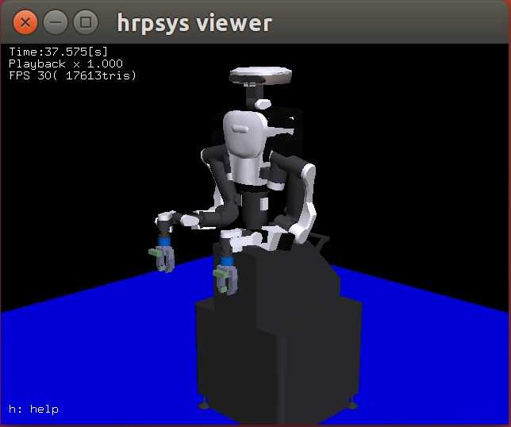
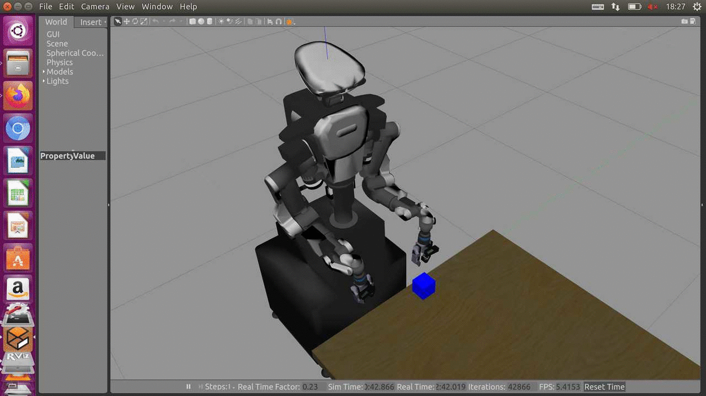
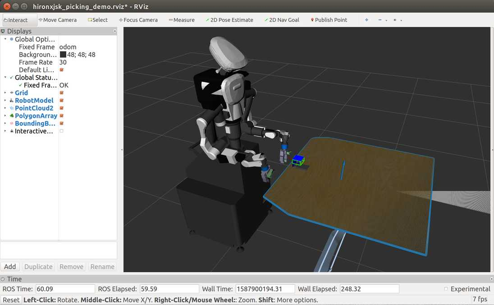

Types of available sample code
==============================

stampit!
--------

Used at IROS 2013 and iREX 2013 in Tokyo. 
NEXTAGE OPEN robot keeps carrying and stamping on a paper
(`video available on youtube <https://www.youtube.com/watch?v=i051WKKelSw>`_).

Without the real robot, you can run the sample by::

  terminal-1$ source `rospack find openrtm_tools`/scripts/rtshell-setup.sh
  terminal-1$ rtmlaunch hironx_tutorial stampit_sim_nodynamics.launch
  
  terminal-2$ rosrun hironx_tutorial stampit_demo.py 

With the real robot,::

  terminal-1$ rtmlaunch hironx_tutorial stampit_realrobot.launch nameserver:=%HOSTNAME%
  
  terminal-2$ rosrun hironx_tutorial stampit_demo.py - --host %HOSTNAME% --port 15005

`%HOSTNAME%` is the host name that can be pinged at, `hiro014` for example.

HIRONXJSK Demos
---------------

Installation
++++++++++++

To run the following demos, you have to build this package with ``hrp2_models`` (closed package) and ``hrpsys_ros_bridge_tutorials``.
If you compiled this package or ``hrpsys_ros_bridge_tutorials`` before you download ``hrp2_models``, you have to compile this package and ``hrpsys_ros_bridge_tutorials`` again with ``--force-cmake`` option after you download ``hrp2_models``.

HIRONXJSK hrpsys simulation
+++++++++++++++++++++++++++

Execution
^^^^^^^^^

.. code-block:: bash

  $ rtmlaunch hironx_tutorial hironxjsk_ros_bridge_simulation.launch

HIRONXJSK Picking Demo
++++++++++++++++++++++

Execution (Gazebo)
^^^^^^^^^^^^^^^^^^

.. code-block:: bash

  $ roslaunch hironx_tutorial hironxjsk_picking_demo.launch
  # Wait until the robot stops moving
  $ rosrun hironx_tutorial hironxjsk-picking-demo.l

Execution (Real Robot)
^^^^^^^^^^^^^^^^^^^^^^

.. code-block:: bash

  # First, start up robot. Then...
  $ roslaunch hironx_tutorial hironxjsk_picking_demo.launch gazebo:=false
  $ rosrun hironx_tutorial hironxjsk-picking-demo.l
