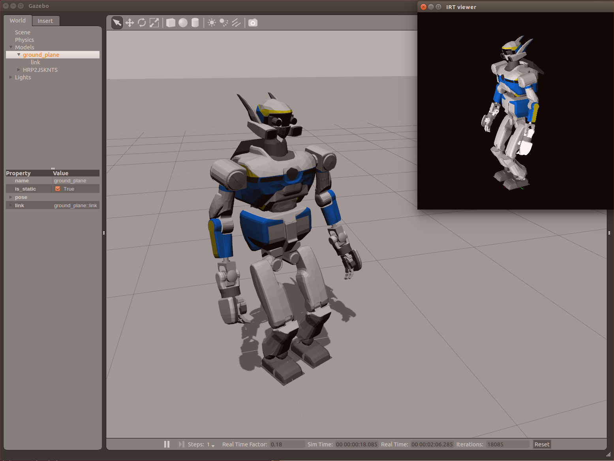
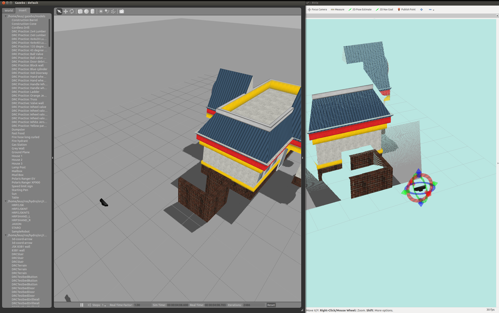
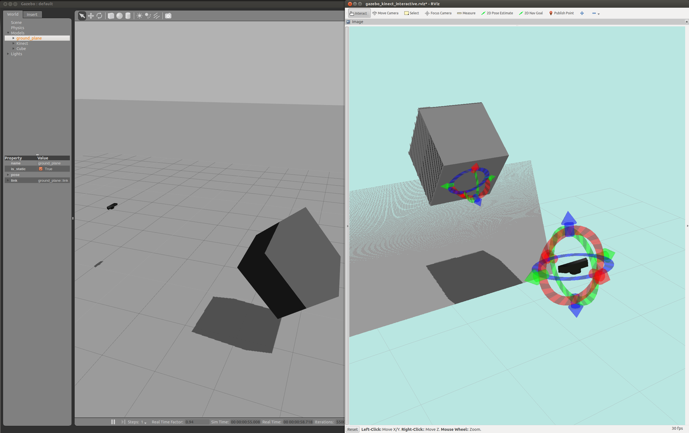
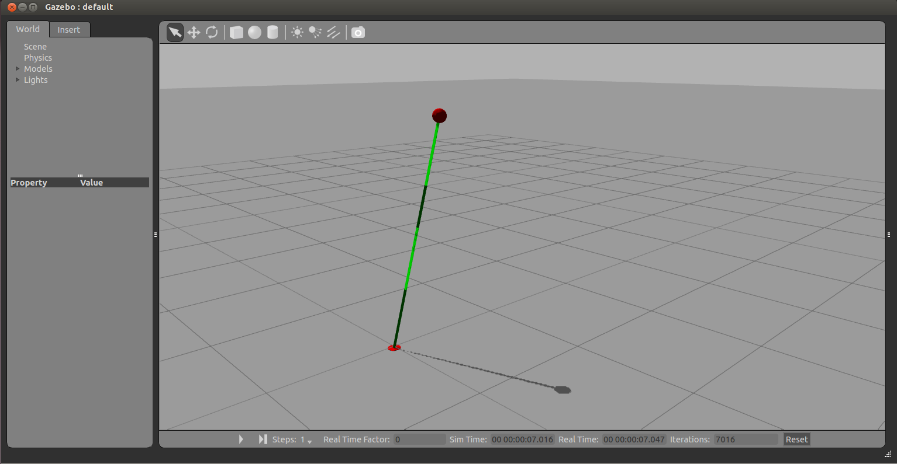

## How to move SampleRobot in Gazebo with hrpsys-base
Confirm if there is a SampleRobot.urdf in ```hrpsys_gazebo_tutorials/robot_models/SampleRobot```
```
roslaunch hrpsys_gazebo_tutorials gazebo_samplerobot_no_controllers.launch
rtmlaunch hrpsys_gazebo_tutorials samplerobot_hrpsys_bringup.launch
roscd hrpsys_ros_bridge_tutorials/euslisp
roseus samplerobot-interface.l
(samplerobot-init)
(objects (list *sr*))
(send *ri* :angle-vector (send *sr* :angle-vector) 5000)
```
Do not forget to type ```pkill gzserver``` in addition to Ctrl-c in order to kill gazebo.

## How to move HRP2JSKNTS in Gazebo with hrpsys-base

```
roslaunch hrpsys_gazebo_tutorials gazebo_hrp2jsknts_no_controllers.launch
rtmlaunch hrpsys_gazebo_tutorials hrp2jsknts_hrpsys_bringup.launch
roscd hrpsys_ros_bridge_tutorials/euslisp
roseus hrp2jsknts-interface.l
(hrp2jsknts-init)
(objects (list *hrp2jsknts*))
(send *ri* :angle-vector (send *hrp2jsknts* :angle-vector) 5000)
```
Do not forget to type ```pkill gzserver``` in addition to Ctrl-c in order to kill gazebo.

## How to test DRC Teleop Program in Gazebo with hrpsys-base
```
roslaunch hrpsys_gazebo_tutorials gazebo_jaxon_without_multisense_no_controllers.launch
rtmlaunch hrpsys_gazebo_tutorials jaxon_hrpsys_bringup.launch
roslaunch jsk_footstep_controller hrp2jsk_footcoords.launch
roslaunch drc_task_common operator_station_main_jaxon.launch
roslaunch drc_task_common field_computer_main.launch USE_LOCALHOST:=true
```
Do not forget to type ```pkill gzserver``` in addition to Ctrl-c in order to kill gazebo.
Force sensor value is not valid.

## Launch gazebo with kinematics mode
Fix the base link of the robot in the reference position of hrpsys.
set `KINEMATICS_MODE` as true in xxx_hrpsys_bringup.launch

e.g.
```
rtmlaunch hrpsys_gazebo_general samplerobot_hrpsys_bringup.launch KINEMATICS_MODE:=true
```

## Kinect interactive mode


Kinect is spawned to gazebo and movable with interactive marker in rviz.
```
roslaunch hrpsys_gazebo_tutorials gazebo_kinect_interactive.launch
```

## Kinect Cube interactive mode


Kinect and cube are spawned to gazebo and movable with interactive marker in rviz.
```
roslaunch hrpsys_gazebo_tutorials gazebo_kinect_cube_interactive.launc
```

## LIP simulation


LIP (Linear Inverted Pendulum) is the simple dynamic model of humanoid robot.
```
roslaunch hrpsys_gazebo_tutorials gazebo_lip.launch

```
